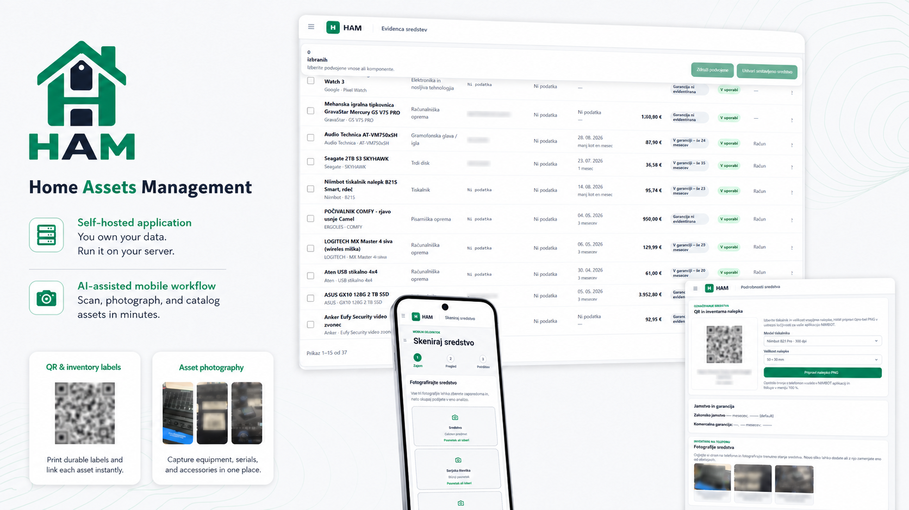
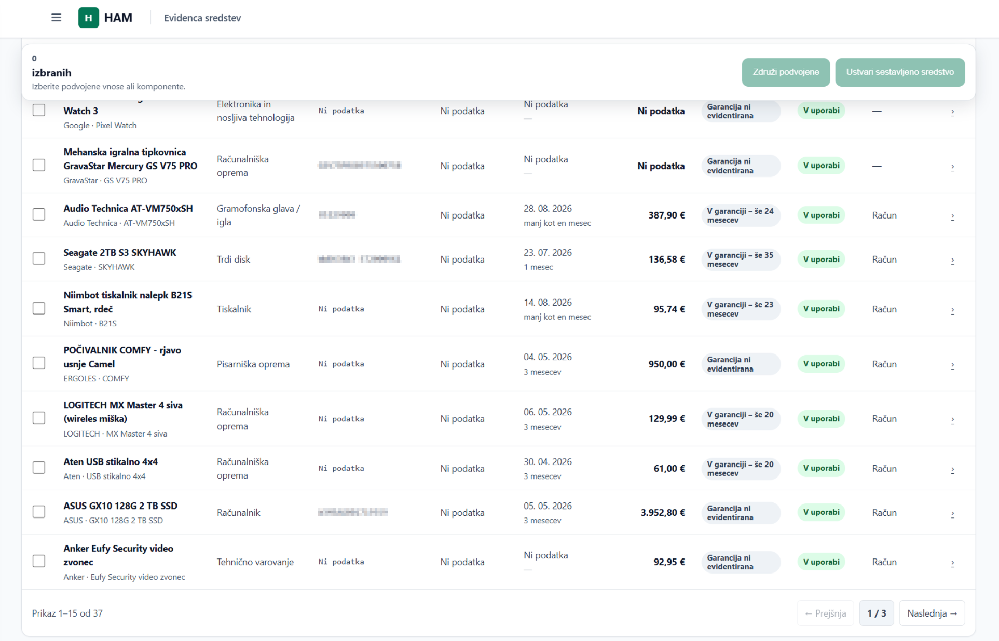
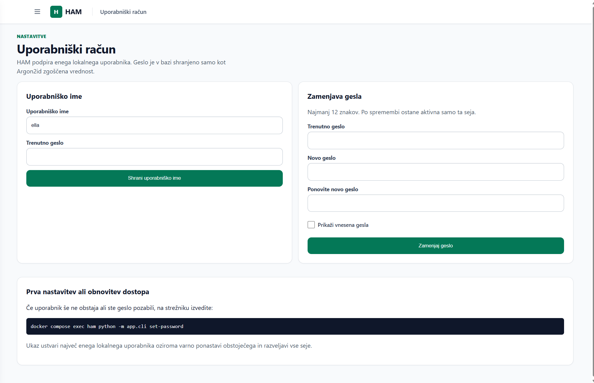
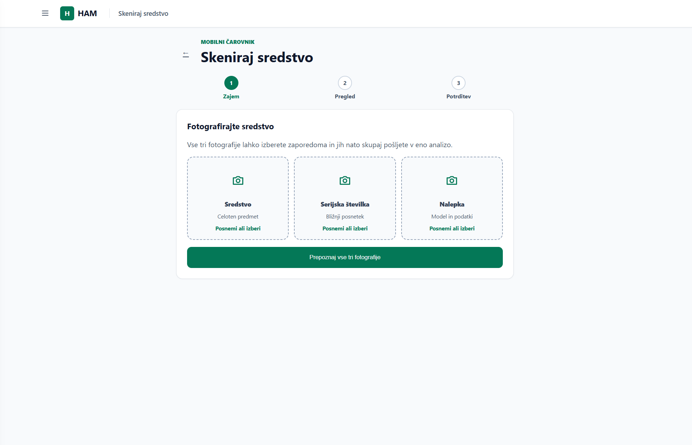
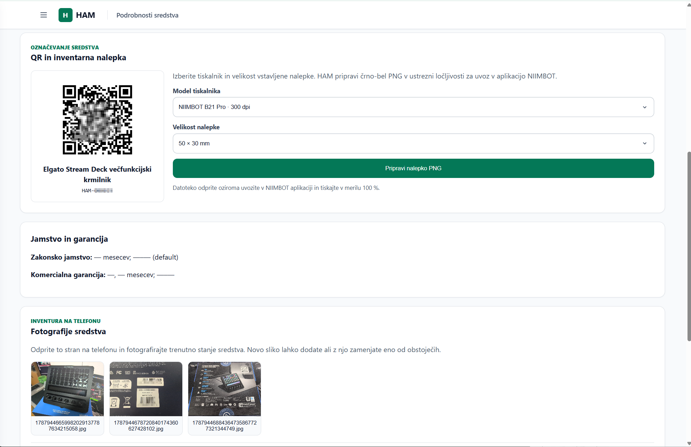
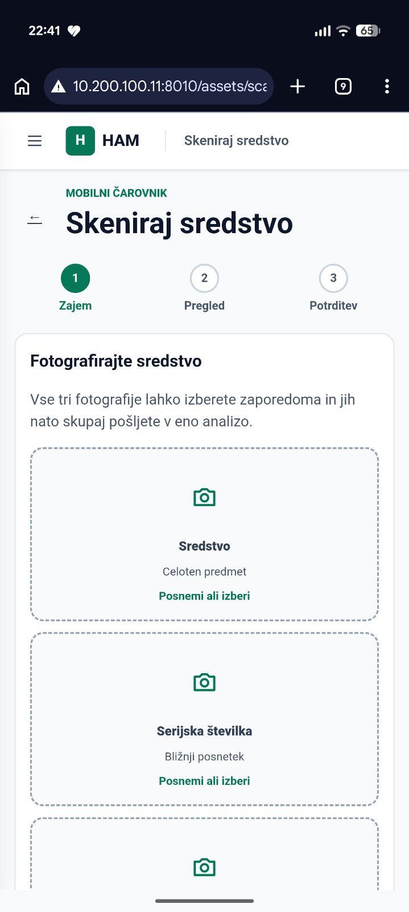
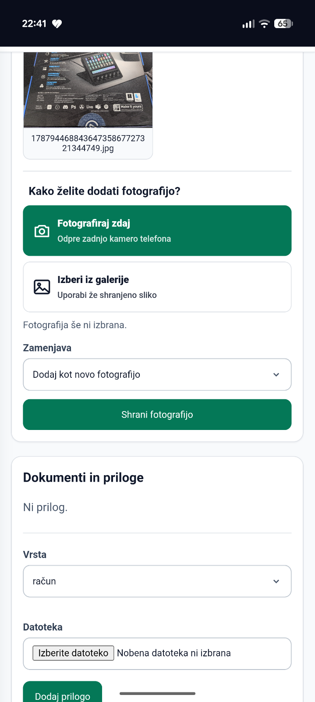

# HAM — Home Assets Management



HAM je lokalno gostovana spletna aplikacija za evidenco domačega premoženja. Uporablja Python 3.13, FastAPI, SQLAlchemy 2, Alembic, SQLite, Jinja2 in HTMX. Uporabniški vmesnik je strežniško izrisan in ne potrebuje Node.js. Osnovno upravljanje deluje lokalno; izbirni mobilni čarovnik za prepoznavo fotografij uporablja Google Gemini API.

**Za posameznike, gospodinjstva in manjše ekipe**, ki želijo imeti naprave, račune, fotografije, jamstva, inventarne številke in QR nalepke urejene na lastnem strežniku.

- odzivna evidenca sredstev z iskanjem, filtri, sortiranjem in sestavljenimi sredstvi;
- mobilni zajem treh fotografij in AI-predizpolnitev podatkov;
- dokumenti, fotografije, jamstva in vgrajeni predogled;
- inventarne številke, QR kode in predloge za tiskalnike NIIMBOT;
- lokalna prijava, Argon2id in podatki pod vašim nadzorom.

> **AI-generated / AI-assisted:** projekt je bil razvit z obsežno pomočjo generativne umetne inteligence pod človeškim vodenjem in pregledom. Pred produkcijsko uporabo preverite kodo, varnost in ustreznost za svoj namen. Podrobnosti so v [AI-GENERATED.md](AI-GENERATED.md).

Licenca: [MIT](LICENSE), Copyright © 2026 Moj-Mobi.

## Pregled aplikacije

### Evidenca in upravljanje

| Evidenca sredstev | Uporabniški račun |
|---|---|
| [](assets/asset-inventory-desktop.png) | [](assets/user-account-desktop.png) |

### AI-zajem, fotografije in označevanje

| Mobilni čarovnik na namizju | QR nalepke in fotografije |
|---|---|
| [](assets/ai-scan-wizard-desktop.png) | [](assets/qr-label-and-photos-desktop.png) |

### Uporaba na telefonu

Kliknite sliko za prikaz v polni velikosti.

<p align="center">
  <a href="assets/ai-scan-wizard-mobile.png"></a>
  &nbsp;&nbsp;
  <a href="assets/asset-photo-mobile.png"></a>
</p>

## Hiter zagon z Dockerjem

Potrebujete Docker z dodatkom Docker Compose. Pri prvi namestitvi kopirajte `.env.example` v `.env` in vanjo vnesite naključno `HAM_SESSION_SECRET` z najmanj 32 znaki. Ustvarite jo z `python -c "import secrets; print(secrets.token_urlsafe(48))"`. Ob nadgradnji obstoječo `.env` ohranite. Po zagonu nastavite uporabnika z `docker compose exec ham python -m app.cli set-password`.

Za uporabo iz brskalnika prek GitHub Codespaces sledite razdelku **github.dev in GitHub Codespaces** spodaj.

```sh
docker compose up -d --build
```

Aplikacija je nato na <http://127.0.0.1:8000>. Stanje preverite z `docker compose ps` ali na <http://127.0.0.1:8000/health>.

Naslov in vrata gostitelja sta nastavljiva z `HAM_BIND_ADDRESS` in `HAM_HOST_PORT` v lokalni datoteki `.env`. Privzeti vrednosti sta `127.0.0.1` in `8000`; vezave ne spreminjajte na `0.0.0.0`, dokler ni dodan dokumentirani varnostni sklop.

Ustavitev:

```sh
docker compose down
```

`compose down` ne izbriše podatkov, ker so v gostiteljski mapi `data/`, ne v vsebniku. Ne uporabljajte `docker compose down -v` za odstranjevanje podatkovnih nosilcev v prihodnjih konfiguracijah.

Na Windows lahko uporabite `start-ham.bat` in `stop-ham.bat`, na Linuxu pa `./start-ham.sh` ter `./stop-ham.sh`. Po kloniranju na Linuxu po potrebi nastavite izvedljivost: `chmod +x *.sh`.

Compose na Linuxu privzeto zažene proces z UID/GID `1000:1000`, da so datoteke v vezani mapi `data/` v lasti običajnega uporabnika. Če ima uporabnik strežnika drugačna identifikatorja, kopirajte `.env.example` v `.env` ter vrednosti `HAM_UID` in `HAM_GID` uskladite z izpisoma `id -u` in `id -g`.

## Trajni podatki

```text
data/
├── database/     # aktivna SQLite baza ham.db
├── attachments/  # priponke in dokumenti
├── backups/      # varnostne kopije
└── imports/      # datoteke za uvoz
```

Celotna mapa se v vsebnik priklopi kot `/app/data`. Vsebina je izključena iz Gita; različica hrani samo datoteke `.gitkeep`. Aktivna SQLite baza mora ostati na lokalnem disku gostitelja. Ne postavljajte je na SMB, NFS ali NAS. Na omrežno lokacijo kopirajte samo zaključene varnostne kopije.

## Varnostna kopija in obnova

Na Linuxu med delovanjem aplikacije izvedite:

```sh
./backup-ham.sh
```

Skripta uporabi SQLite Online Backup API in ustvari časovno označeno konsistentno kopijo v `data/backups/`. Poleg baze ločeno kopirajte tudi `data/attachments/`. Kopije redno prenesite na drugo napravo in preizkusite obnovo.

Obnova: ustavite HAM, obstoječo `data/database/ham.db` najprej varno preimenujte, izbrano kopijo skopirajte na njeno mesto kot `ham.db`, nato aplikacijo zaženite. Pred obnovo shranite še trenutno stanje.

## Posodobitev

1. Izdelajte varnostno kopijo.
2. Pridobite novo različico kode.
3. Zaženite `docker compose up -d --build`.
4. Preverite `docker compose ps` in `/health`.

Vsebnik pred zagonom sam izvede `alembic upgrade head`. Podatkovna mapa pri ponovni izdelavi slike ali ponovnem ustvarjanju vsebnika ostane nedotaknjena.

## Neposredni razvojni zagon

Uporabite Python 3.13:

```sh
python -m venv .venv
.venv/Scripts/pip install -e ".[dev]"   # Windows
.venv/Scripts/alembic upgrade head
.venv/Scripts/uvicorn app.main:app --reload
```

Na Linuxu sta ustrezni poti `.venv/bin/...`. Teste zaženete z `pytest`.

## Dostop in varnostne meje MVP

Compose vrata privzeto objavi le na `127.0.0.1`, zato aplikacija brez izrecne nastavitve ni dostopna iz domačega omrežja ali interneta. HAM vključuje enouporabniško prijavo z Argon2id, strežniško preverljivo sejo, CSRF zaščito obrazcev in omejitev dovoljenih gostiteljev. Gesel, licenčnih ključev ali plačilnih podatkov se ne shranjuje v navadnem besedilu.

Internetna objava ni del MVP. Za poznejši HTTPS je predviden reverse proxy (na primer Nginx) na istem Linux strežniku; dodan naj bo šele skupaj s preverjeno avtentikacijo, HTTPS certifikati in ustreznimi omrežnimi pravili.

## Arhitektura

SQLAlchemy model in seja sta ločena od poti FastAPI. Povezava je nastavljiva z `HAM_DATABASE_URL`, vendar MVP podpira in preizkuša samo SQLite. Morebitni prehod na PostgreSQL bo izveden z migracijami, brez sočasnega vzdrževanja dveh baz.

Statični datoteki za slog in HTMX sta vključeni lokalno, zato običajna uporaba ne potrebuje internetne povezave.

## Sredstva, jamstva in priloge

Obrazec vodi ločeno evidenco zakonskega jamstva za skladnost in komercialne garancije. Pri novem ali rabljenem blagu poslovnega prodajalca predlaga 24 mesecev zakonskega jamstva; uporabnik lahko trajanje in iztek vedno popravi. Priloge so v `data/attachments`, v bazi so le metapodatki in povezave.

Ročni vnos je na `/assets/new`, upravljavska evidenca pa na `/assets`. Evidenca podpira iskanje, hitre filtre in razvrščanje po stolpcih, strežniško paginacijo ter mehko arhiviranje. Privzeto so najnovejši vnosi prikazani na vrhu. Arhiviranje ne izbriše sredstva ali prilog; revizija `20260826_04` doda ločen čas arhiviranja.

V evidenci lahko izberete več sredstev. **Združi podvojene** ohrani izbrani glavni zapis, vanj dopolni manjkajoče podatke in priloge ter druge zapise revizijsko označi kot združene. **Ustvari sestavljeno sredstvo** ustvari virtualno nadrejeno sredstvo in izbrane zapise ohrani kot samostojne komponente. Privzeti pogled pokaže glavna sredstva; filter strukture omogoča tudi vse zapise, samo skupine ali samo komponente.

Na podrobnostih obstoječega sredstva je razdelek **Fotografije sredstva**. Na telefonu lahko neposredno odprete kamero, dodate novo fotografijo ali izberete obstoječo fotografijo, ki jo nova nadomesti. Fotografije ostanejo povezane z evidenco in imajo vgrajen predogled.

Vsako novo sredstvo samodejno dobi unikatno inventarno številko oblike `HAM-000001`; migracija jo dodeli tudi obstoječim zapisom. Podrobnosti sredstva prikažejo QR kodo z nazivom in inventarno številko. HAM lahko pripravi črno-belo PNG nalepko velikosti 50 × 30, 40 × 30 ali 50 × 20 mm za NIIMBOT B21 (203 dpi), B21 Pro (300 dpi) ali M2 (300 dpi). PNG uvozite v aplikacijo NIIMBOT in tiskajte v merilu 100 %.

Račun v obliki PDF, JPG ali PNG lahko pred shranjevanjem lokalno predizpolni podatke. Besedilni PDF obdela `pypdf`; slike obdela `pytesseract` s slovenskimi in angleškimi podatki Tesseract OCR (oboje je vključeno v Docker sliko). Pri neposrednem razvojnem zagonu mora biti Tesseract z jezikoma `slv` in `eng` nameščen v sistemu; brez njega ostane varen ročni vnos. Omejitev velikosti določa `HAM_MAX_ATTACHMENT_BYTES` (privzeto 10 MiB). Aplikacija preveri dejanski podpis datoteke in uporablja naključno interno ime.

Mobilni čarovnik je na `/assets/scan` in v glavnem meniju pod **Skeniraj sredstvo**. Sprejme do tri fotografije (celotno sredstvo, serijsko številko in nalepko), jih v eni zahtevi analizira z Gemini ter ponudi pregled in popravek pred zapisom. Po potrditvi se sredstvo in vse fotografije povežejo v evidenci. Za vklop v meniju **Nastavitve / AI** vnesite Gemini API ključ; priporočeni privzeti model je `HAM_GEMINI_MODEL=gemini-3.7-flash`. Ključa nikoli ne dodajte v Git.

V evidenci lahko označite eno ali več navadnih sredstev in izberete **AI-oceni vrednost**. HAM cenitve z Google Search izvede v trajni čakalni vrsti v ozadju ter shrani modelno leto, ocenjeno prvotno ceno, razpon rabljene vrednosti za EU in Slovenijo, verjetnost garancije, zaupanje in vire. Ocenjeni podatki nikoli ne prepišejo dejanske cene ali potrjene garancije. Skupna nakupna vrednost zato za vsako sredstvo uporabi dejansko ceno, če obstaja, sicer ocenjeno prvotno ceno, in jasno pokaže število uporabljenih AI-ocen. Google Search poizvedbe so lahko obračunane skladno s pogoji izbranega Gemini modela.

Klik na fotografijo ali dokument na podrobnostih sredstva odpre vgrajeni predogled. Slike in PDF se strežejo z dispozicijo `inline`; izrecni gumb **Prenesi** uporablja ločeno pot za prenos. Predogled je odziven, dostopen s tipkovnico in prilagojen telefonom.

## Prijava in inicializacija uporabnika

V strežniški `.env` ustvarite najmanj 32 znakov dolgo naključno `HAM_SESSION_SECRET`. Vrednost varno ustvarite z `python -c "import secrets; print(secrets.token_urlsafe(48))"`, je ne dodajte v Git in je ne podajajte kot argument ukaza. Pred uporabo aplikacije izvedite:

```sh
docker compose exec ham python -m app.cli set-password
```

Ukaz interaktivno vpraša za uporabniško ime in dvakrat skrito geslo dolžine najmanj 12 znakov. Isti ukaz spremeni geslo in razveljavi obstoječo sejo. Prijava je na `/login`, odjava pa v glavi aplikacije. Po petih neuspehih je račun blokiran 15 minut; počakajte na iztek ali ponovno varno nastavite geslo prek CLI. Piškotki so pri lokalnem HTTP dostopu `HttpOnly` in `SameSite=Lax`; seja privzeto poteče po 60 minutah neaktivnosti (`HAM_SESSION_MAX_AGE_SECONDS=3600`). Ob poznejšem HTTPS nastavite `HAM_SECURE_COOKIES=true`.

V bazi ni gesla v čitljivi obliki. Tabela `local_users` vsebuje uporabniško ime, Argon2id zgoščeno vrednost gesla, stanje blokade in SHA-256 zgoščeni identifikator trenutno veljavne seje. Po prijavi je v hamburger meniju stran **Uporabniški račun**, kjer lahko uporabnik ob potrditvi s trenutnim geslom spremeni uporabniško ime ali geslo. Sprememba gesla razveljavi druge seje. Če je dostop izgubljen, isti CLI-ukaz varno ponastavi edinega lokalnega uporabnika.

Za LAN dostop nastavite HAM_BIND_ADDRESS na konkretni naslov strežnika in HAM_ALLOWED_HOSTS na dovoljene gostitelje. Ne uporabljajte .0.0.0; HTTP promet ni šifriran.

## Dostop iz domačega omrežja

Ciljni strežnik HAM je v zaupanja vrednem domačem omrežju dostopen samo na `http://10.200.100.11:8010`. Gostiteljska vezava je omejena na `10.200.100.11`, ne na vse vmesnike. Uporablja se HTTP, zato je `HAM_SECURE_COOKIES=false` zavestna začasna nastavitev. Dostop iz interneta ni dovoljen. Za račun uporabite unikatno geslo; pred dostopom iz nezaupanja vrednega omrežja sta obvezna HTTPS in `HAM_SECURE_COOKIES=true`.

## Nastavitve Gemini API ključa

Prijavljeni uporabnik odpre **Nastavitve / AI** (`/settings/ai`), vnese ključ in izbere **Shrani in preveri ključ**. Vmesnik pokaže prve štiri znake in pet zvezdic (`ABCD*****`), stanje »Ključ je nastavljen« ter rezultat zadnjega preverjanja: zeleno **Veljaven**, rdeče **Neveljaven** ali nevtralno opozorilo, če preverjanje ni uspelo. Čas preverjanja je prikazan ob rezultatu; gumb **Preveri povezavo** ga osveži. Preverjanje uporablja [Gemini models.list](https://ai.google.dev/api/models#method:-models.list), brez generiranja vsebine. Uspeh ne zagotavlja razpoložljivosti izbranega modela ali zadostne kvote za AI-zahteve.

Ključ se hrani v `data/private/gemini.json`, izven baze in Gita. Na Linuxu ima mapa dovoljenja `0700`, datoteka `0600`; pri neposrednem zagonu na Windows je dostop omejen z ACL na račun procesa. Skrbnik gostitelja lahko še vedno dostopa do ključa. Datoteka ni šifrirana in je aplikacija ne streže. Pri varnostnih kopijah celotne mape `data/` zaščitite tudi to datoteko; če je ne obnovite, ponovno vnesite ključ.

Zamenjava takoj velja za nove zahteve prepoznave in posamezne cenitve, že poslane zahteve se dokončajo s prejšnjim ključem. Odstranitev trajno onemogoči AI, tudi če je v okolju ostal `GEMINI_API_KEY`; prazna zasebna datoteka mora zato ostati prisotna. Obstoječi okoljski ključ se uporablja samo, dokler zasebna datoteka še ne obstaja. Shranjeni ključ lahko zamenjate tudi, če preverjanje zaradi povezave ali omejitve storitve ne uspe.

## github.dev in GitHub Codespaces

**github.dev je urejevalnik, ne strežnik:** nima terminala in ne more zagnati Dockerja ali HAM. V njem lahko urejate datoteke in shranite spremembe v Git. Za delujočo aplikacijo v brskalniku uporabite **GitHub Codespaces**, za trajno domačo namestitev pa svoj Docker strežnik. [Razlika med github.dev in Codespaces](https://docs.github.com/en/codespaces/the-githubdev-web-based-editor).

### Prva namestitev v Codespaces

1. Odprite repozitorij na GitHubu. Za lastne spremembe najprej ustvarite fork. Izberite **Code → Codespaces → Create codespace on main**. Če ste v github.dev, se vrnite na stran repozitorija na github.com in odprite Codespace od tam.
2. V terminalu Codespace, v korenu projekta, izvedite:

   ```sh
   docker compose version
   python3 setup-codespaces.py
   docker compose up -d --build --wait
   docker compose exec ham python -m app.cli set-password
   ```

   Pripravljalna skripta ustvari `.env` z naključno sejno skrivnostjo, pravilnim UID/GID, dovoljenim gostiteljem tega Codespace in varnimi piškotki za HTTPS. Obstoječe `.env` nikoli ne prepiše. Ključ Gemini vnesete pozneje v aplikaciji. Če okolje nima Docker Compose, uporabite privzeto okolje Codespaces z Dockerjem ali svojo Docker namestitev.
3. V zavihku **Ports** dodajte vrata **8000**, če se ne pojavijo samodejno. Vidnost pustite **Private**, protokol povezave do aplikacije **HTTP**. Kliknite **Open in Browser**: zunanji naslov uporablja HTTPS, notranja aplikacija pa HTTP. V naslovni vrstici mora biti naslov oblike `https://IME-CODESPACE-8000.DOMENA` (skripta ga tudi izpiše).
4. Prijavite se z uporabnikom iz prejšnjega koraka. V **Nastavitve / AI** lahko dodate ključ **Google Gemini**; drugi ponudniki trenutno niso podprti.

Privatna posredovana vrata zahtevajo tudi prijavo v GitHub. [Posredovanje vrat](https://docs.github.com/en/codespaces/developing-in-a-codespace/forwarding-ports-in-your-codespace) in [okoljske spremenljivke Codespaces](https://docs.github.com/en/codespaces/developing-in-a-codespace/default-environment-variables-for-your-codespace) so opisane v uradni dokumentaciji.

Codespaces je razvojno okolje: aplikacija ni na voljo, ko se Codespace ustavi, in izbris Codespace odstrani njegove lokalne podatke. Pred izbrisom prenesite varnostne kopije in priloge iz okolja. Za stalno uporabo uporabite lastni strežnik. GitHub Pages prav tako ne more gostovati te aplikacije Python/SQLite.

### Ponovni zagon, osvežitev in nadgradnja

Po ponovnem odprtju **istega** Codespace ali ponovnem zagonu strežnika uporabite:

```sh
docker compose up -d --wait
```

Za osvežitev prikaza uporabite ponovno nalaganje strani; če brskalnik kaže star CSS, uporabite **Ctrl+Shift+R**. Osvežitev brskalnika ne posodobi kode na strežniku.

Za nadgradnjo po prvi namestitvi v terminalu **iste namestitvene mape** izvedite:

```sh
sh backup-ham.sh
git status --short
git pull --ff-only
docker compose up -d --build --wait
docker compose ps
curl --fail http://127.0.0.1:8000/health
```

Če `git status` pokaže lastne spremembe kode, jih najprej shranite v commit ali ločeno kopijo in uskladite s posodobitvijo. Če `git pull --ff-only` odpove, razrešite stanje Gita pred gradnjo. Pri forku najprej uporabite **Sync fork** na GitHubu, če želite prevzeti spremembe iz izvornega projekta. Na lastnem strežniku prilagodite zadnji URL dejanski vezavi in vratom; na naši namestitvi je `http://10.200.100.11:8010/health`.

Ohranite `.env` in celotno mapo `data/`. Uporabnika in ključa ni treba nastaviti znova, pripravljalne skripte pa ne zaganjajte ponovno. Baza se nadgradi samodejno ob zagonu. Skripta `backup-ham.sh` kopira samo bazo: ločeno varnostno kopirajte še `data/attachments/`, `.env` in po potrebi `data/private/`, ki vsebuje API ključ. Kopije s skrivnostmi hranite zasebno in jih ne nalagajte v Git. Za popolno kopijo lahko HAM najprej ustavite z `docker compose stop ham`, kopirate te poti in ga ponovno zaženete.

Če ustvarite **nov Codespace**, ima ta drug gostiteljski naslov. Ob obnovi obstoječe `.env` posodobite `HAM_ALLOWED_HOSTS` na novi naslov iz zavihka Ports (brez `https://`), ohranite `127.0.0.1,localhost` in nato znova ustvarite vsebnik z `docker compose up -d --force-recreate --wait`.

### Namestitev na lastni Docker strežnik

Datoteke lahko urejate v github.dev in jih potrdite v Git, namestitev pa izvedete v terminalu strežnika:

```sh
git clone https://github.com/moj-mobi/home-assets-management.git
cd home-assets-management
cp .env.example .env
```

Uredite `.env`: nastavite `HAM_SESSION_SECRET`, UID/GID strežniškega uporabnika ter želene naslove in vrata. Nato izvedite `docker compose up -d --build --wait` in `docker compose exec ham python -m app.cli set-password`. Za svojo različico uporabite URL svojega forka. Nadgradnje izvajajte s postopkom zgoraj; zasebnega domačega naslova `10.200.100.11` Codespace brez dodatne omrežne povezave ne doseže.

## CSS in HTTPS reverse proxy

CSS, JavaScript, logotipi in povezave filtrov uporabljajo poti na isti domeni (npr. `/static/css/app.css`). Tako brskalnik ohrani zunanji HTTPS naslov tudi, kadar HAM za proxyjem vidi HTTP; ne nastanejo absolutne HTTP povezave do teh virov. To odpravlja možen vzrok blokiranega CSS zaradi mešane vsebine.

HAM namestite v koren namenske domene, npr. `https://ham.example.com/`. Objavljanje pod podpotjo, kot je `/ham/`, trenutno ni podprto, saj navigacija in obrazci uporabljajo poti od korena.

Za svoj reverse proxy:

- Posredujte vse poti, tudi `/static/`, na HAM, ohranite glavo `Host` in nastavite `X-Forwarded-Proto` ter `X-Forwarded-For`.
- V `.env` dodajte zunanji gostiteljski naslov v `HAM_ALLOWED_HOSTS` (brez sheme ali poti) in za zunanji HTTPS nastavite `HAM_SECURE_COOKIES=true`.
- `HAM_FORWARDED_ALLOW_IPS` nastavite na dejanski IP oziroma omejeno omrežje zaupanja vrednega proxyja, kot ga vidi vsebnik. Compose ga posreduje Uvicornu kot `FORWARDED_ALLOW_IPS`. Privzeto je `127.0.0.1`; pri proxyju v drugem vsebniku to običajno ni pravilen naslov. Ne uporabljajte `*`, če je backend dosegljiv tudi mimo zaupanja vrednega proxyja.
- Po spremembi `.env` izvedite `docker compose up -d --force-recreate --wait`.

Primer lokacije za Nginx, ki teče neposredno na istem gostitelju kot HAM z vezavo `127.0.0.1:8000` (znotraj že konfiguriranega HTTPS `server` bloka):

```nginx
location / {
    proxy_pass http://127.0.0.1:8000;
    proxy_set_header Host $host;
    proxy_set_header X-Forwarded-Proto $scheme;
    proxy_set_header X-Forwarded-For $remote_addr;
    client_max_body_size 35m;
}
```

Če Nginx teče v Dockerju, njegov `127.0.0.1` kaže nanj samega: uporabite naslov HAM, dosegljiv iz proxyja. Pri obstoječi LAN namestitvi naj nastavitev ustreza dejanski vezavi, ne kopirajte loopback primera dobesedno. [FastAPI za proxyjem](https://fastapi.tiangolo.com/advanced/behind-a-proxy/) in [Uvicorn nastavitve zaupanja](https://www.uvicorn.org/settings/) pojasnjujejo posredovane glave.

Če slog še manjka, v brskalniku preverite zahtevo `/static/css/app.css`: mora vrniti HTTP 200 in `Content-Type: text/css`, ne prijavne strani proxyja ali 404. Napaka 400 pri odpiranju HAM običajno pomeni, da zunanjega imena ni v `HAM_ALLOWED_HOSTS`.
